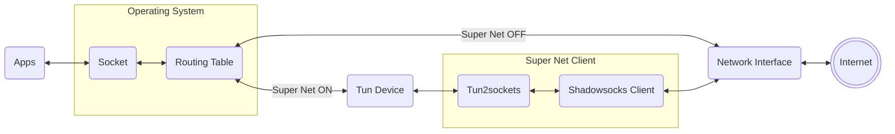

# Life of a Packet

```mermaid
flowchart LR
  A(Apps) <--> S(Socket)
  subgraph Operating System
    S <--> R(Routing Table)
  end
  R <-- Super Net OFF --> IF(Network Interface)
  IF <--> INET(((Internet)))
  R <-- Super Net ON --> TUN(Tun Device)
  TUN <--> T2S(Tun2sockets)
  subgraph Super Net Client
    T2S <--> SC(Shadowsocks Client)
  end
  SC <--> IF
  click TUN "https://en.wikipedia.org/wiki/TUN/TAP" _blank
```
